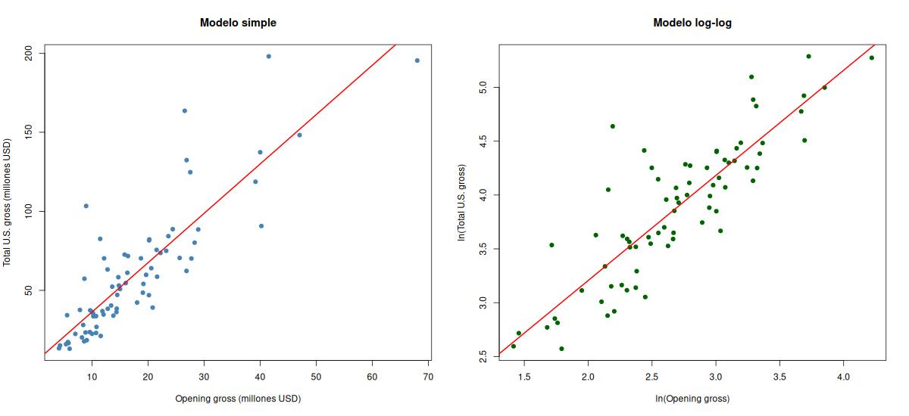
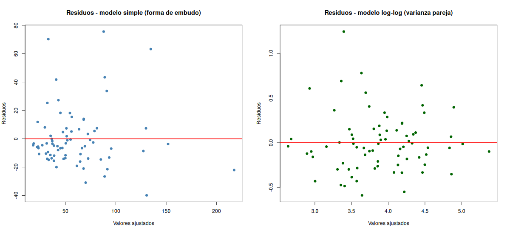

# Punto 7e y 7g

## 7e. Modelo sólido de total U.S. gross a partir del opening gross

En la regresión simple los residuos se abren en forma de embudo: a mayor opening gross, mayor
dispersión (heterocedasticidad, Breusch-Pagan p ≈ 0.06). Además, unas pocas películas muy
taquilleras pesan mucho en el ajuste, por lo que las pruebas t de ese modelo no son confiables.

El modelo sólido es el **log-log**:

**ln(Total U.S. gross) = 1.2526 + 0.9766 · ln(Opening gross)**

Los residuos tienen varianza pareja (Breusch-Pagan p ≈ 0.17). Si el opening gross sube 1 %,
el total U.S. gross sube aproximadamente 0.98 %. Coeficientes en `7e_modelo_loglog.csv`.

## 7g. Proporción de la variación explicada

El R² del modelo log-log es **0.7511**: alrededor del **75 %** de la variación del total U.S. gross
(en logaritmos) se explica por la variación del opening gross. Ver `7g_comparacion_modelos_R2.csv`.
