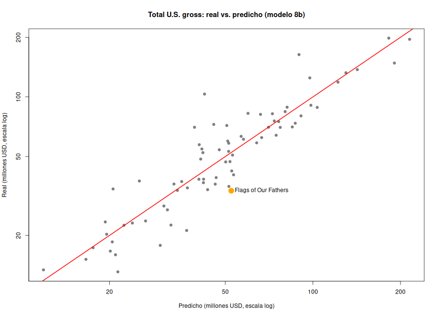

# Punto 8

## 8a. Modelo con todos los factores conocidos tras el estreno

Variable dependiente: ln(Total U.S. gross). Variables: ln(opening gross), budget, comedy, R-rated,
known story, sequel, summer, holiday, christmas, opening theatres y critics' opinion.
Resultados en `8a_modelo_completo.csv`.

## 8b. Modelo final (variables significativas al 10 %)

Variables eliminadas, en orden: christmas (p = 0.8674); holiday (p = 0.7349); theatres (p = 0.6852); sequel (p = 0.4158); known (p = 0.367); r_rated (p = 0.2299); summer (p = 0.1296)

**ln(Total) = 0.7937 + 0.8725 ln(Opening) + 0.00440 Budget(M) + 0.1599 Comedy + 0.00935 Critics**

R² = 0.845, R² ajustado = 0.836. Coeficientes en `8b_modelo_final.csv`.

- Opening: +1 % de opening gross → +0.87 % de total U.S. gross.
- Budget: +1 millón de presupuesto → +0.44 % de total U.S. gross.
- Comedy: las comedias recaudan ~17 % más, con lo demás constante.
- Critics: +1 punto de crítica → +0.94 % de total U.S. gross.

## 8c. Película con las características de Flags of Our Fathers

Estimación puntual: **USD 52.4 millones**. Intervalo de predicción al 95 %: **USD 30.2 a 91.1 millones**.
La película recaudó USD 33.6 millones: menos de lo esperado, pero dentro del intervalo. Su crítica
fue buena (79 puntos), así que culpar a los críticos de su fracaso no se sostiene.

## 8d. ¿Cuánto invertir para subir la crítica de 79 a 89 puntos?

Subir 10 puntos aumenta el total U.S. gross en ~9.8 %: de USD 52.4 M a USD 57.5 M (**+USD 5.1 M**).
Como el distribuidor recibe como máximo el 70 % de la taquilla, Griffith no debería invertir más de
**unos USD 3.6 M** (algo más solo si se cuentan ingresos fuera de EE. UU., DVD, etc.).
Ver `8d_critica_79_vs_89.csv`.
