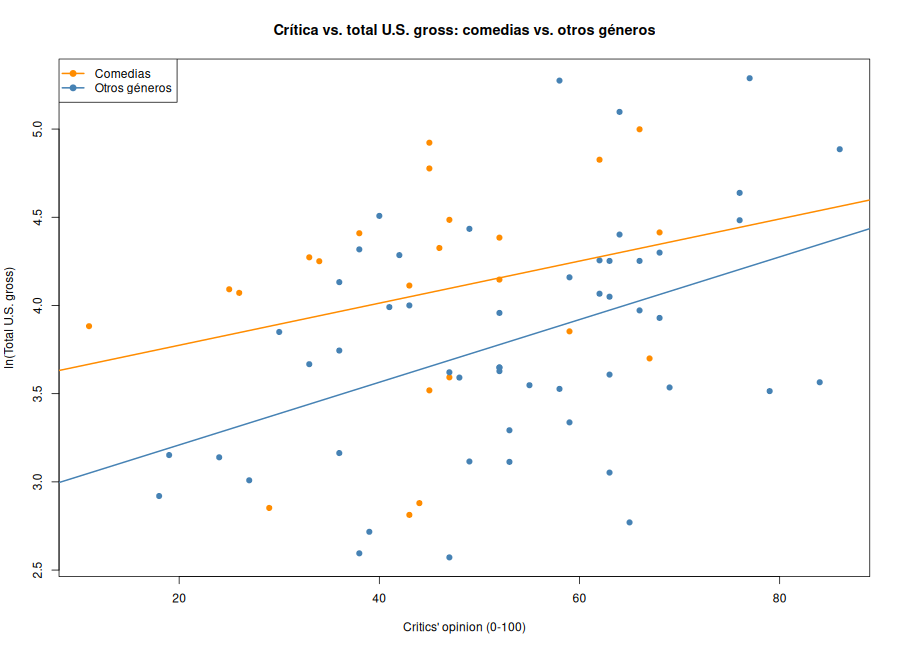

# Puntos 9 y 10

## 9. ¿La crítica afecta menos a las comedias?

Se agregó al modelo del punto 8 la interacción critics × comedy (`9_modelo_interaccion.csv`).

- Efecto de cada punto de crítica en no comedias: ~1.0 % más de total U.S. gross.
- Efecto en comedias: ~0.7 %.
- Coeficiente de la interacción: -0.0033 (t = -0.71, p de una cola ≈ 0.24).

El signo va en la dirección que dice Griffith, pero la interacción **no es significativa**
(p > 0.10). Con estos datos **no se puede probar su teoría**. Ver `9_prueba_griffith.csv`.

## 10. Star power

Si se agregara la variable *star power* (número de estrellas A-list) al modelo del punto 9,
para que la conclusión de Griffith fuera correcta:

1. El coeficiente de **star power** debería ser **positivo y significativo**: más estrellas,
   más total U.S. gross, con lo demás constante.
2. El coeficiente de **budget** debería **bajar mucho (acercarse a cero) y dejar de ser
   significativo**. Hoy budget es significativo en parte porque absorbe el efecto de las
   estrellas: sus sueldos (USD 15 M o más) inflan el presupuesto. Es un sesgo por variable
   omitida, porque star power está correlacionada con el presupuesto y con la taquilla.

Si al incluir star power el coeficiente de budget siguiera grande y significativo, la
conclusión de Griffith sería falsa.
